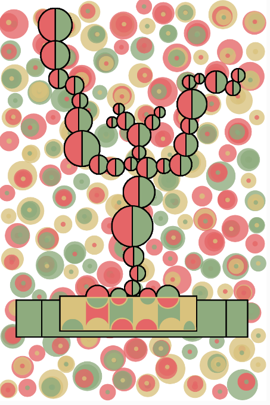
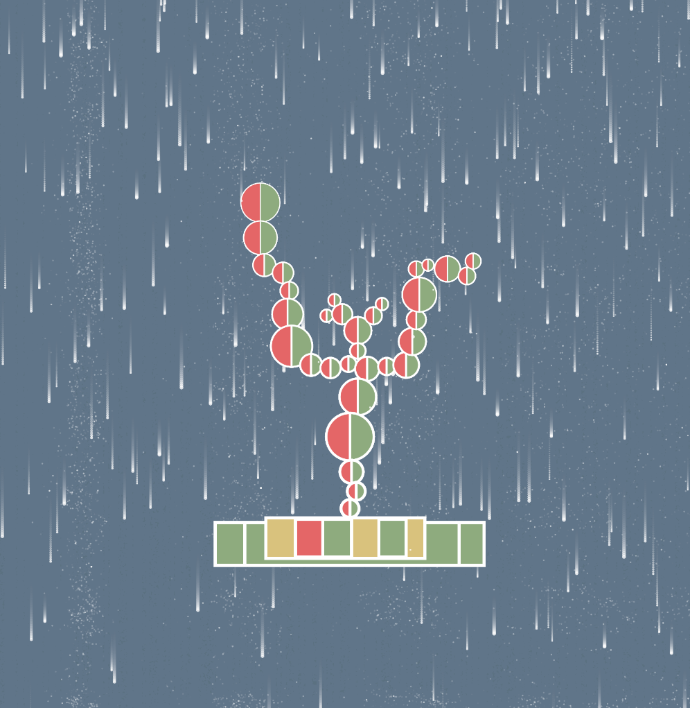

# ypan0680_9103_Tut5_GroupB

## Project Overview
This project is an interactive animated artwork designed to engage users through mouse interaction and Perlin noise-driven animations. The piece features a central "apple tree" structure that responds dynamically to user input, including hover effects and outline thickness variations. A gentle snow effect adds to the wintery ambiance, creating a visually engaging and immersive experience.

## Interaction Instructions
- **Mouse Interaction**: Move the mouse slowly across the screen to observe changes in the circles’ colors and sizes. Hovering over specific elements will trigger a fade-out effect.
- **Perlin Noise**: Create soft, floating snow on the screen.
- **Contour thickness**: The bottom contour thickness of the "apple tree" is thicker, and the top contour thickness is thinner. Added the realism of snow falling on the canvas.

## Individual Approach
My individual contribution to the project centers around creating an organic, interactive experience by combining **Perlin noise** and **mouse-driven interaction**. This approach makes the animation flow smoothly, with unique feedback when users engage with different parts of the artwork.

### Driver of Individual Code
This animation is primarily driven by:
- **Interaction**: Mouse movement triggers visual changes in color, size, and opacity of specific elements, offering direct feedback to the user.
- **Perlin Noise**: Perlin noise introduces natural variations in position, giving elements like snowflakes a realistic drift effect as they fall.

### Animated Properties
The following properties are animated in this project:
1. **Color and Opacity**: Hovering over circles changes their color and opacity, creating a gradual fade-out effect.
2. **Outline Thickness**: The outline thickness of the base elements varies with vertical position, with thicker outlines toward the bottom, which helps create depth.
3. **Snowflake Motion**: Snowflakes drift down the screen in a randomized, natural path influenced by Perlin noise, contributing to a winter-like atmosphere.

This approach ensures that my work is distinct from other group members by emphasizing outline variation and subtle color transitions, while others may focus on component size changes or reveal effects.

## Inspiration
The design and animation were influenced by:
- **Snowfall GIFs**: These provided a reference for creating a realistic, calming snow effect, ensuring the snowflakes fall at a natural pace and with a soft opacity.
- **Organic Movement Animations**: I explored animations that used Perlin noise to create lifelike, smooth transitions, which inspired the gentle flow of snowflakes and the subtle movements in this artwork.

### Example Image:
  

## Technical Explanation
- **Perlin Noise Implementation**: Perlin noise drives the movement of snowflakes, giving them a fluid, organic drift as they descend.
- **Mouse Interaction**: The `mouseMoved` function detects the mouse's position, adjusting elements' properties like color and size based on proximity.
- **Outline Thickness Control**: A custom function calculates outline thickness for each element based on its vertical position, with shapes closer to the bottom having thicker outlines for a bolder appearance.

## Modifications to Code
At first, I wanted to learn from By Steve's Makerspace
[View Example Code](https://editor.p5js.org/StevesMakerspace/sketches/AWvuvS1VG)
I made my first attempt to fill the background with apples of all sizes.

But I found the picture too chaotic, so I gave up the idea.

Significant changes to the final code include:
- Implementing Perlin noise for fluid snowflake movement.
- Adding mouse-driven color transitions and fade-out effects.
- Adjusting outline thickness based on `y` position for increased visual depth in the composition.

## External Techniques
I referenced online tutorials to better understand **Perlin noise** implementation, which helped me create natural, flowing animations. These tutorials were particularly useful for understanding noise-based movement, which I adapted to suit the snowfall effect in this artwork.
### Example Link:
[View Example Code](https://miguelrr11.github.io/Noise_Flow_Field/)

### Final Example Screenshot:

